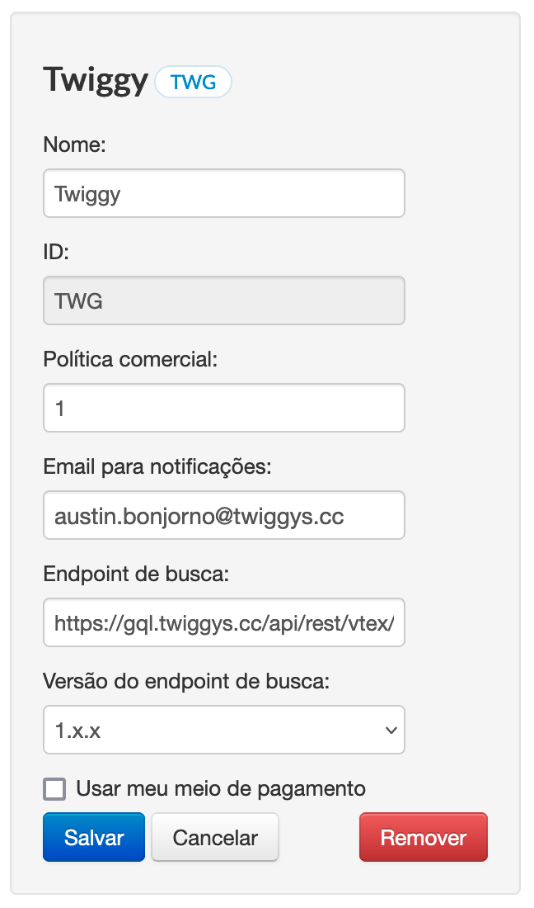

# Como adicionar a Twiggy como afiliada

- Acesse o cadastro de afiliados através do admin de sua loja `https://dominio_da_sua_loja_aqui.com/admin/checkout/#/affiliates/new`;
- Preencha o formulário conforme a imagem abaixo;
- Em endpoint de busca, basta colocar `https://gql.twiggys.cc/api/rest/vtex/notification`;
- Clique em "Salvar".

## Formulário de afiliados

